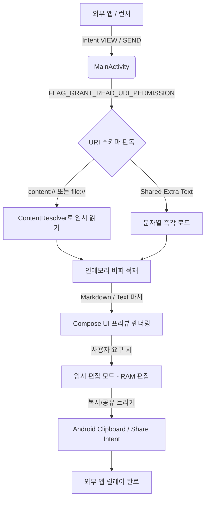

# arch/current-architecture.md

## MDRelay Current Architecture Snapshot

MDRelay는 AI가 생성한 문서를 빠르게 로드해 확인하고 간단히 수정하여 타 앱으로 즉각 릴레이하는 단일 액티비티 구성의 Jetpack Compose 기반 Android 애플리케이션입니다.

---

## 1. 아키텍처 한 줄 요약
> "No-DB, No-Storage-Permission, 단일 MainActivity를 진입점으로 삼아 Android Intent URI를 실시간 파싱하고 메모리 기반 편집 및 공유를 처리하는 경량 마크다운/JSON 릴레이 뷰어"

---

## 2. 런타임 흐름 & 데이터 파이프라인 (Runtime Flow)

앱 기동부터 공유 완료까지의 핵심 데이터 흐름은 다음과 같습니다.

---

## 3. 핵심 컴포넌트 및 패키지 구조

* **`app/`**: Android 어플리케이션 모듈의 루트.
  * **`src/main/AndroidManifest.xml`**: Intent 필터링 선언 및 FolderSync 연동을 위한 `<queries>` 패키지 명세 보관.
  * **`src/main/java/com/simpsonys/mdrelay/MainActivity.kt`**: UI 그리기(Material3 Scaffold), URI 디코딩, 인코딩 판별, 뷰어 상태 머신, 클립보드 공유 호출이 전부 결합된 단일 핵심 엔진.
  * **`src/main/res/`**: 앱 아이콘 및 테마 스타일 리소스.

---

## 4. 빌드, 테스트 및 구동 명령어 요약
공식 로컬 Façade `ysdadev`를 활용한 빌드 환경 매핑은 아래와 같습니다:
* **빌드:** `.\ysdadev.cmd build` -> Gradle `assembleDebug`
* **테스트:** `.\ysdadev.cmd test unit` -> Gradle `testDebugUnitTest` (테스트 유무 무관 작동)
* **설치:** `.\ysdadev.cmd install` -> adb -s <serial> install -r app-debug.apk
* **실행:** `.\ysdadev.cmd run` -> monkey -p com.simpsonys.mdrelay로 MainActivity 런칭

---

## 5. 알려진 리스크 및 전제 조건 (Risks & Assumptions)
1. **대용량 파일 제약:** 전체 데이터를 메모리에 한 번에 적재하므로, 수십 MB를 넘어서는 AI 산출물 인입 시 메모리 압박이 있을 수 있습니다.
2. **Intent 임시 권한 만료:** 수신한 `content://` URI는 MainActivity가 백그라운드로 전환되거나 OS에 의해 프로세스가 킬당하는 경우 임시 읽기 권한이 회수될 수 있습니다. 이를 감안해 뷰어가 활성화되어 메모리에 적재된 내용을 기준으로 릴레이합니다.
3. **FolderSync 결합성:** FolderSync 패키지 유무를 질의할 때 OS 가시성 제약이 존재하므로 명세된 가시성 패키지 쿼리 선언이 항상 빌드에 온전히 병합되어 있어야 합니다.
4. **외부 폰트 미사용:** 스타일 코드에서 강제로 폰트 패밀리를 수정하지 않도록 방어적인 리뷰가 준수되어야 합니다.
